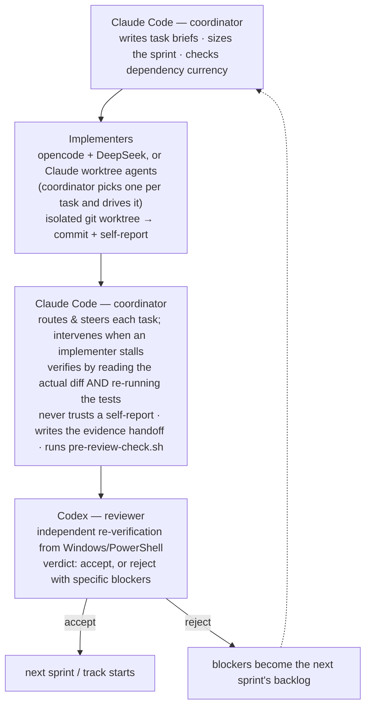
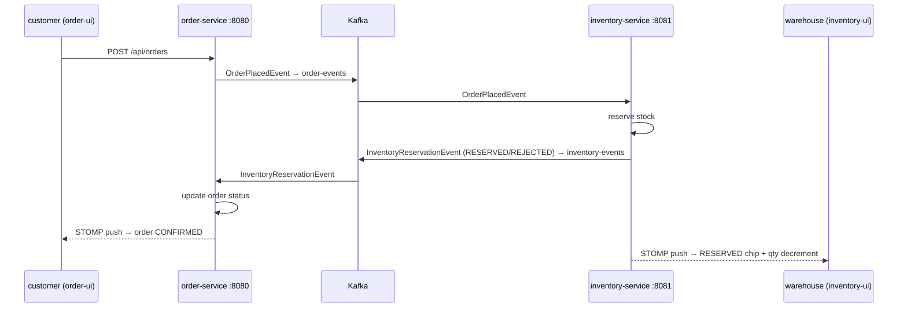

# Build Smart with Agents — Enterprise Demo

A demo monorepo that shows what a real multi-agent development workflow looks like: not the happy path, but the full 13-sprint arc — including the bugs the coordinator introduced, the failures the reviewer caught, and the rules that came out of each one.

The system itself is recognisable enterprise territory: JWT-based SSO, a Kafka choreographed saga, and two Angular SPAs — not a toy, but explainable in 10 minutes.

---

## What the system does

`auth-server` issues RSA-signed JWTs and acts as the single identity source for the whole stack. `order-service` (port 8080) and `inventory-service` (port 8081) implement a two-step choreographed saga over Kafka: a customer places an order, inventory reserves stock and sends back a `RESERVED` or `REJECTED` event, and the order status updates in real time via STOMP/WebSocket. Two Angular 22 SPAs (`order-ui` on 4200, `inventory-ui` on 4201) show both sides of the saga live.

---

## The agent workflow

Three roles, no central orchestrator. **Claude Code is the coordinator, and it opens and closes every loop** — it writes the briefs, decides who implements each task, drives that implementer, and verifies the result before a reviewer (or human) ever sees it.



The coordinator is not a passive router. It **chooses the implementer per task** — read-verifiable changes (a CI workflow, a selector) go to a Claude worktree agent; subtle-correctness work (transactional idempotency, concurrency) goes to opencode + DeepSeek for a genuinely independent second implementation. It **drives both** kinds from the same machine (spawning Claude subagents, or running DeepSeek headless via `opencode run`), **intervenes mid-run** when an implementer misdiagnoses a failure (e.g. resuming a stuck DeepSeek session with a precise root-cause hint), and **re-runs the real test suite itself** rather than trusting any "Pass" it's handed. The reviewer (Codex) stays independent regardless of who implemented. Coordinator-direct edits are reserved for trivial docs and CI metadata — never logic.

Sprint artifacts: `docs/backlog/sprint-N.md` (overview), `docs/backlog/tasks/sprint-N/<ID>-<slug>.md` (per-task briefs), `docs/backlog/sprint-N-handoff.md` (coordinator's evidence), `reviews/sprint-N-track-X-review.md` (Codex verdict).

---

## Architecture

### Kafka choreographed saga



### Auth flow

`auth-server` (port 9000) signs JWTs with an RSA key pair and exposes the public key via JWKS (`/oauth2/jwks`). `order-service` and `inventory-service` are pure resource servers — no local user store, token validated against `auth-server`'s JWKS. Registration is gated: new users start `PENDING` until an admin approves them.

### Module map

| Module | Port | Description |
|--------|------|-------------|
| `shared-model` | — | Maven library: cross-service DTOs and Kafka event contracts |
| `auth-server` | 9000 | Spring Boot SSO: JWT issuance, JWKS, Google OAuth2, user admin |
| `order-service` | 8080 | Spring Boot: order management, Kafka saga publisher/consumer |
| `inventory-service` | 8081 | Spring Boot: stock management, Kafka saga consumer/publisher |
| `order-ui` | 4200 | Angular 22 SPA: place orders, live status feed |
| `inventory-ui` | 4201 | Angular 22 SPA: SKU table, live reservation feed |

---

## Continuous integration

GitHub Actions (`.github/workflows/ci.yml`) runs on every push to `main` and every PR: `shared-model` builds and tests first as a fail-fast gate, then `auth-server`, `order-service`, and `inventory-service` build and test in parallel (each builds `shared-model` inline into its local Maven repo), and both Angular UIs build. Java is pinned to 21, Node to 22. A broken test in one module fails only that module's job.

---

## Running locally

### Prerequisites

- Java 21 (Maven Enforcer rejects other versions)
- Docker (for the Kafka broker)
- Node.js 20+ and npm
- PowerShell (for Angular builds; `ng build`/`npm install` write to Windows `node_modules`)

### 1. Start Kafka

```powershell
cd order-service
docker compose up -d
```

### 2. Build shared-model and start Java services

```powershell
# One-time: install shared-model to local Maven repo
cd shared-model && .\mvnw.cmd clean install

# Start each in its own terminal (Java 21 required)
cd auth-server     && .\mvnw.cmd spring-boot:run   # :9000
cd order-service   && .\mvnw.cmd spring-boot:run   # :8080
cd inventory-service && .\mvnw.cmd spring-boot:run # :8081
```

### 3. Start the Angular UIs

```powershell
cd order-ui     && npm.cmd install && npm.cmd start  # :4200
cd inventory-ui && npm.cmd install && npm.cmd start  # :4201
```

### 4. Log in

| Role | Email | Password | UI |
|------|-------|----------|----|
| Customer | `customer1@example.test` | `customer123` | order-ui :4200 |
| Warehouse staff | `warehouse1@example.test` | `warehouse123` | inventory-ui :4201 |

### 5. Run the Playwright smoke test (optional)

```powershell
cd e2e
npm.cmd install
npx.cmd playwright install chromium
npx.cmd playwright test --headed   # runs headed so you can watch both browsers
```

The smoke test exercises the full saga: login → place order → wait for CONFIRMED badge → verify inventory decrements.

---

## Screenshots

> Screenshots require the full stack running. See `docs/demo-script.md` for the exact capture sequence.

Key moments to capture:
- **inventory-ui after login** — SKU table with SKU-001, SKU-002, SKU-003 rows and quantity on hand
- **order-ui after placing an order** — order card with green CONFIRMED badge
- **inventory-ui after saga completes** — reservation feed showing RESERVED chip, SKU-001 quantity decremented

---

## The story behind this project

Track A (Sprints 1–13) took 13 sprint rounds to close — not because the system is complex, but because the workflow itself was being built at the same time as the system. Five moments that shaped how the workflow works:

1. **Sprint 1** — concurrent edits on one shared tree caused cross-file contamination. Isolated worktrees added.
2. **Sprint 4** — reached Codex with 2 of 5 tasks unstarted and no commit. `pre-review-check.sh` added.
3. **Sprint 9** — the *coordinator* removed `ChangeDetectionStrategy.Eager` as "code hygiene," not knowing Angular 22 inverts the CD logic when the field is absent. Cost two sprint rounds.
4. **Sprint 11** — `mat-table` stayed empty despite all CD fixes. Root cause required reading compiled Angular 22 source. Fix: `MatTableDataSource`.
5. **Sprint 13** — Track A approved. Full Playwright smoke passes against a non-empty local DB.

Full retrospective with all three perspectives (coordinator, reviewer, implementer): [`docs/backlog/track-a-retro.md`](docs/backlog/track-a-retro.md)

---

## Presentation assets

- [`docs/story.md`](docs/story.md) — narrative arc suitable for a blog post or talk notes
- [`docs/demo-script.md`](docs/demo-script.md) — step-by-step live demo presenter guide
- [`docs/talk-outline.md`](docs/talk-outline.md) — slide structure for a 30-minute conference talk
- [`docs/conference-prep-handoff.md`](docs/conference-prep-handoff.md) — handoff to Codex for producing screenshots and presentation assets
- [`docs/assets/sprint17-observable-boundary-catches.png`](docs/assets/sprint17-observable-boundary-catches.png) — reusable evidence board for the Sprint 17 reviewer catches

---

## Architecture decision record

[`docs/adr/0001-event-driven-showcase-architecture.md`](docs/adr/0001-event-driven-showcase-architecture.md) — the original design decision for the Kafka choreographed saga pattern.
