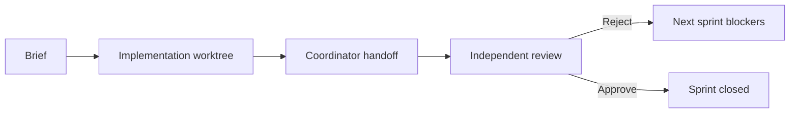

# Talk Outline

Working title: **Build Smart With Agents: The Reviewer Gate That Kept Saying No**

## 30-Minute Version

### 1. The Problem With Typical AI Demos - 2 min

- Most demos show one prompt and a polished ending.
- Real work fails in ways that still look plausible in code review.
- This repo is useful because it kept the failure trail instead of deleting it.

### 2. The Workflow We Used Instead - 5 min

- Implementer: `opencode + DeepSeek`
- Coordinator: Claude Code
- Reviewer: Codex
- Worktrees, handoffs, and `pre-review-check.sh` as the process skeleton

Visual:

### 3. Failure 1: The Sprint Was Not Actually Done - 3 min

- Sprint 4 reached review with two tasks still unstarted.
- No commit checkpoint meant the state itself was ambiguous.
- Process rule created: `pre-review-check.sh` before every review handoff.

### 4. Failure 2: Angular CD Bug Introduced By Cleanup - 6 min

- Sprint 9 added the right zone scheduling work.
- The coordinator removed `ChangeDetectionStrategy.Eager` as cleanup.
- Angular 22 behavior made that assumption wrong.
- Sprint 10 restored the right rendering behavior.

Speaker note: this is the credibility anchor because the coordinator, not the implementer, caused the regression.

### 5. Failure 3: Playwright Selectors Versus Dirty State - 6 min

- Sprint 11: table fixed with `MatTableDataSource`.
- Sprint 11-12: selectors still failed because the DB was not empty and the DOM shape was not what people assumed.
- Sprint 13: `data-testid="order-card"` plus count-based assertions finally cleared the gate.

Speaker note: selectors are part of the product contract, not test garnish.

### 6. Rules That Came Out Of The Retro - 3 min

- Acceptance criteria must describe observable outcomes.
- Dirty DB is the default assumption.
- Browser-required work must be labelled explicitly.
- Handoffs must include actual command output and explicit limitations.

### 7. Live Demo Or Recorded Walkthrough - 5 min

- Show `order-ui` and `inventory-ui`.
- Place one `SKU-001` order.
- Watch `CONFIRMED`, `RESERVED`, and the decrement.
- State that this is the exact smoke path that finally closed Track A.

### 8. Track B Epilogue - 4 min

- Sprint 14: local green, Linux CI metadata red, then fixed.
- Sprint 15: CI green, runtime red, then runtime green.
- Sprint 16: runtime green, scanner red, then live Snyk green.
- Sprint 17: plausible Testcontainers and outbox changes, but reviewer still catches lifecycle and observable-boundary flaws.

Suggested visual order:

1. `docs/demo-notes-sprint-14.md`
2. `docs/demo-notes-sprint-15.md`
3. `docs/demo-notes-sprint-16.md`
4. `docs/assets/sprint17-observable-boundary-catches.png`

### 9. Q&A - 1 min

Prompt: "Where would you put the hard reviewer gate in your own agent workflow?"

## 15-Minute Video Version

1. 0:00-1:00 — why this is not a happy-path AI story
2. 1:00-3:00 — the three-role workflow
3. 3:00-5:30 — live or recorded saga walkthrough
4. 5:30-8:30 — Angular change detection and selector failures
5. 8:30-11:30 — Track B reliability and security evidence
6. 11:30-13:30 — Sprint 17 exactly-once boundary lesson
7. 13:30-15:00 — what to copy into your own workflow

## Slide List

1. Build Smart With Agents
2. What The App Does
3. The Three-Agent Loop
4. Kafka Choreographed Saga
5. Sprint 4: Handoff Claimed More Than Reality
6. Sprint 9/10: Coordinator Introduced A CD Bug
7. Sprint 11-13: Browser Gate Stayed Red
8. Track A Approved
9. Rules We Kept
10. Sprint 14: CI Failure-To-Green
11. Sprint 15: Runtime Failure-To-Green
12. Sprint 16: Security Visibility Failure-To-Green
13. Sprint 17: Observable Boundary Catches
14. Q&A

## Speaker Notes

Sprint 9/10:

"A plausible cleanup changed framework behavior in a way no one intended. The lesson is not that AI is bad at coding. The lesson is that review has to be capable of proving the coordinator wrong."

Sprint 11-13:

"The app was not broken in theory. The browser was broken in reality. That difference is why the browser gate exists."

Sprint 15:

"CI did not catch the hardcoded JWKS URL because CI was not exercising the documented container topology. The runtime smoke did."

Sprint 16:

"Adding a scanner is not the same as having a scanner gate. The gate only became real when live CI proved that Snyk authenticated, scanned real projects, and uploaded machine-readable evidence."

Sprint 17:

"A Testcontainers test can still be wired incorrectly, and an outbox can still duplicate user-visible events. Exactly-once claims have to be proven where the user sees behavior."
